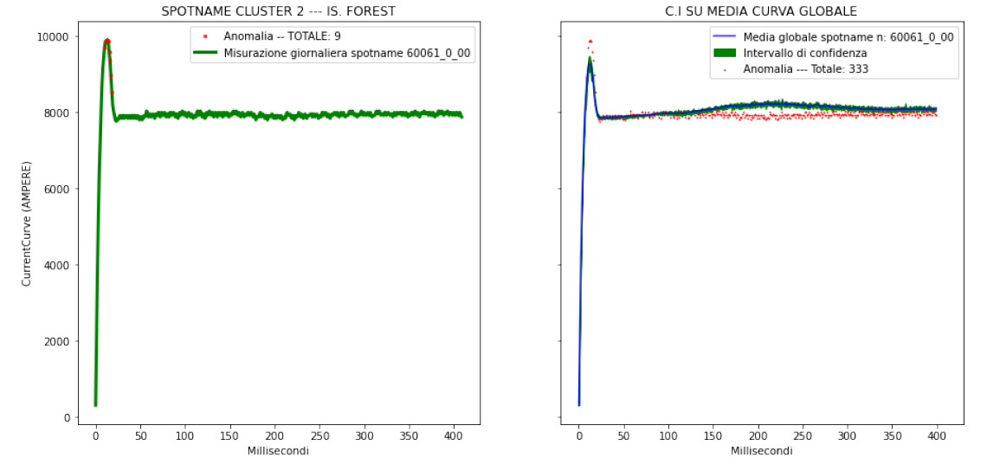

# Welding Anomaly Detection Project

## Problem Statement

The problem addressed in this project, presented by the Research Center of a leading automotive company, focuses on identifying anomalies within the welding process curves generated during the manufacturing of automobile chassis. The objective is to enhance production efficiency and reduce welding process anomalies. This was achieved through the application of unsupervised Machine Learning algorithms and descriptive and inferential statistical analysis tools.

## Data and Preprocessing

The welding process data, provided by the company in JSON files, were aggregated and organized into a Pandas DataFrame. The relevant fields were Timestamp (start time of welding), SpotName (welding location), CurrentCurve (array of current values), and VoltageCurve (array of voltage values). Data cleaning and analysis were performed on the collected dataset.

## Model Training

### Clustering Algorithms

Several clustering algorithms were evaluated:

- **DBSCAN (Density-Based Spatial Clustering of Applications with Noise):** An algorithm for identifying dense areas and classifying points outside these areas as anomalies.

- **Hierarchical Clustering:** A bottom-up approach to grouping data points into clusters.

- **Time Series K-Means:** Utilizing K-Means clustering to analyze curve centroids.

### Anomaly Detection Algorithms

Two anomaly detection algorithms were employed:

- **Isolation Forest:** A method for isolating anomalies based on their separation from the rest of the data.

- **Confidence Interval:** A technique using confidence intervals to identify anomalies.



## Results

The implementation of the advanced welding process monitoring and optimization model has led to significant improvements in the company's operations and overall performance:

### Operational Efficiency

1. **Defect Reduction:**
   - Percentage reduction in welding defects: 18%
   - Annual cost savings attributed to defect reduction: $245,000

2. **Downtime Minimization:**
   - Decrease in average monthly downtime for maintenance: 12%
   - Increase in overall equipment effectiveness (OEE): 9%

## Conclusion

The project demonstrates the application of unsupervised Machine Learning techniques to identify welding anomalies within the Industry 4.0 framework. By analyzing welding process curves and utilizing clustering and anomaly detection algorithms, the company can optimize its production process and maintain consistent product quality.

For more details and results, please refer to the complete report.

## Setting up a Virtual Environment and Installing Dependencies
1. **Clone the Repository**
   ```bash
   git clone <repository_url>
   cd <repository_directory>
2. **Create and activate a virtual environment using `virtualenv`**.
3. **Once the virtual environment is active, you can install the project's dependencies from the requirements.txt file**:
    ```bash
    pip install -r requirements.txt
    ```

